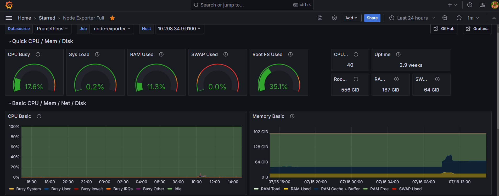
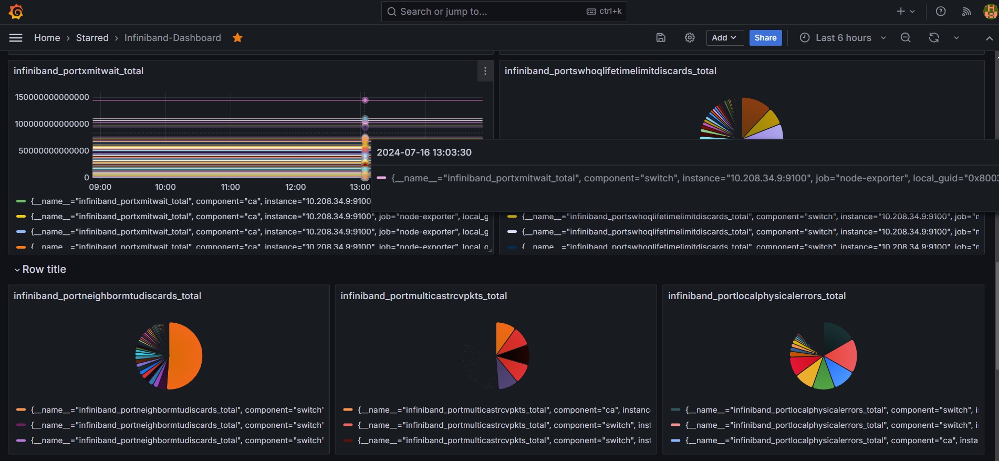
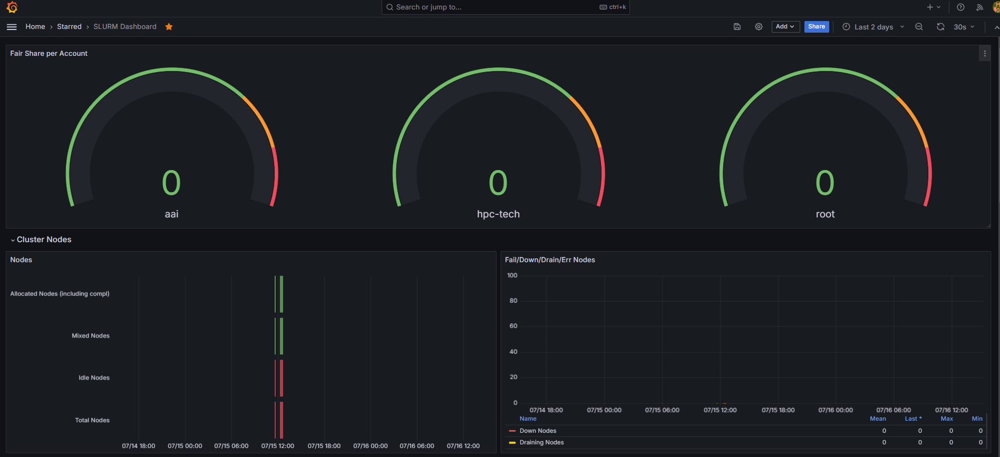

# Dashboards

**Creating a New Dashboard**

1. Click on the `+` icon in the sidebar and select `Dashboard`.
2. Click `Add new panel`.
3. Click `Save` and give your dashboard a name.

**Sample Configured Dashboards**

