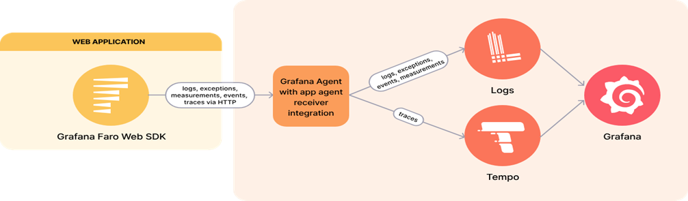

# Grafana Documentation 
Welcome to the Grafana documentation. Here you will find all the necessary information to install and configure grafana. 
For full documentation visit [grafana.com](https://grafana.com/docs/grafana/latest/).

## Project layout

    grafana docs/
        - index.md  # The documentation homepage.
        - installation.md
        - configuration.md
        - datasources.md
        - dashboards.md
  

## What is Grafana ?
   Grafana is a multi-platform open source analystics and interactive visualization web application.It provides

   - **Charts**
   - **Graphs**
   - **Alerts**


## Features 
   - **Visualize**: Grafana has a plethora of visualization options to help you understand your data beautifully.
   - **Alert** : Seamlessly define alerts where it makes sense- while you're in data 
   - **Unify** : Grafana supports dozens of databases,natively.Mix them together in the same Dashboard 
   - **Open Source**: Grafana is completely open source, and backed by a vibrant community.
   - **Extend** : Discover hundreds of dashboards and plugins in the ooficial library


## Steps for installating Grafana

1) **Add Grafana GPG key and repository:**

     ```sh
    sudo wget -q -O - https://packages.grafana.com/gpg.key | sudo apt-key add -
    sudo add-apt-repository "deb https://packages.grafana.com/oss/deb stable main"
    ```

2) **Install Grafana:**

    ```sh
    sudo apt-get update
    sudo apt-get install grafana
    ```
3) **Start and enable Grafana service:**

    ```sh
    sudo systemctl start grafana-server
    sudo systemctl status grafana-server
    sudo systemctl enable grafana-server
    ```
4) **Access Grafana:**

    Open your browser and go to `http://localhost:3000`. The default login is `admin` and password is `admin`.

    ( Note: Grafana by default runs on port no: 3000 )


# Datasource
We're going to add Prometheus Datasource to our Grafana. But before adding it we should know about Prometheus

## What is Prometheus ?
  
- Prometheus is a software application used for event monitoring and alerting
- It records real-time metrics in a time series database built using a HTTP pull model.
 

## Steps For Installing Prometheus

1  **Create a Directory:**
   
    ```sh
    create a directory of any name say "grafana"
    mkdir grafana 
    cd grafana
    ```

2  **Download Prometheus:**

    ```sh
    wget https://github.com/prometheus/prometheus/releases/download/v2.53.0-rc.1/prometheus-2.53.0-rc.1.linux-amd64.tar.gz
    ```

3 **Extract the tar file:**

    ```sh
     tar -xvf prometheus-2.53.0-rc.1.linux-amd64.tar.gz
     cd prometheus-2.53.0-rc.1.linux-amd64/
    ```
4  **Create a systemd service file for Prometheus:**
    
```sh
    sudo vi /etc/systemd/system/prometheus.service
   
    (add the following line of code to make a service file for your Prometheus)
    
    [Unit]
    Description=Prometheus Service
    After=network.target

    [Service]
    Type=simple
    ExecStart=/usr/local/bin/prometheus/prometheus --config.file=/usr/local/bin/prometheus/prometheus.yml

    [Install]
    WantedBy=multi-user.target

```
     

5 **Reload systemd and start Prometheus:**

    ```sh
    sudo systemctl daemon-reload
    sudo systemctl start prometheus
    sudo systemctl enable prometheus
    ```
6 **Access Prometheus:**

    Open your browser and hit `10.208.34.9:9090`.
    (Note : Prometheus by deafault runs on port no. 9090)

Prometheus primarily pulls data from various exporters and endpoints configured in the `prometheus.yml` file.


# Common Exporter


- **Node Exporter:** Collects hardware and OS metrics.
 
## Steps For Installing Prometheus
```sh
wget https://github.com/prometheus/node_exporter/releases/download/v1.8.1/node_exporter-1.8.1.linux-amd64.tar.gz

tar -xvf node_exporter-1.8.1.linux-amd64

sudo cp node_exporter-1.8.1.linux-amd64/node_exporter /usr/local/bin/

```
2  **Create a systemd service file for Node-Exporter:**
    
```sh
    sudo vi /etc/systemd/system/node-exporter.service
   
    (add the following line of code to make a service file for your Node-Exporter)
    
    [Unit]
    Description=Prometheus Node Exporter Service
    After=network.target

    [Service]
    Type=simple
    ExecStart=/usr/local/bin/node_exporter

    [Install]
    WantedBy=multi-user.target
```

3 **Start and enable the service**:

```sh
    sudo systemctl daemon-reload
    sudo systemctl start node_exporter
    sudo systemctl enable node_exporter
```
## Adding a Prometheus Datasource In Grafana

1. Go to `Configuration > Data Sources`.

2. Click on `Add data source`.

3. Select `Prometheus` from the list.

4. Configure the following settings:
    - **Name:**  Prometheus
    - **URL:**  http://localhost:9090   


5. Click `Save & Test`.


# Dashboards

**Creating a New Dashboard**

1. Click on the `+` icon in the sidebar and select `Dashboard`.
2. Click `Add new panel`.
3. Click `Save` and give your dashboard a name.


# Troubleshooting

## Common Issues

- **Grafana Server Not Starting:**
    - Check the logs located at `/var/log/grafana/grafana.log`.
    - Ensure the service is running: `sudo systemctl status grafana-server`.

- **Datasource Not Connecting:**
    - Verify the URL and credentials.
    - Check the datasource service is running.
    - Check Grafana logs for errors.
